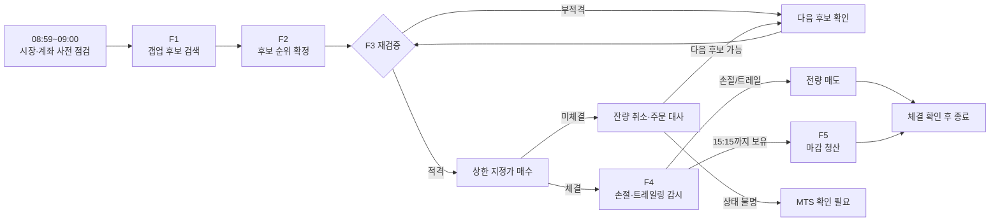
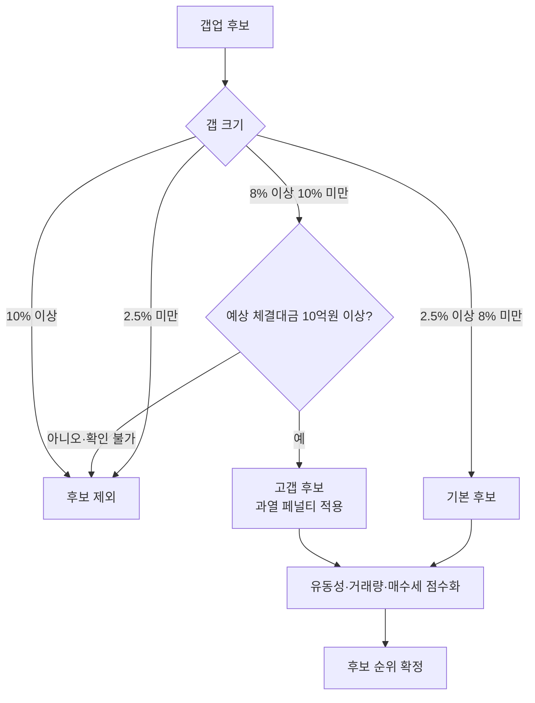
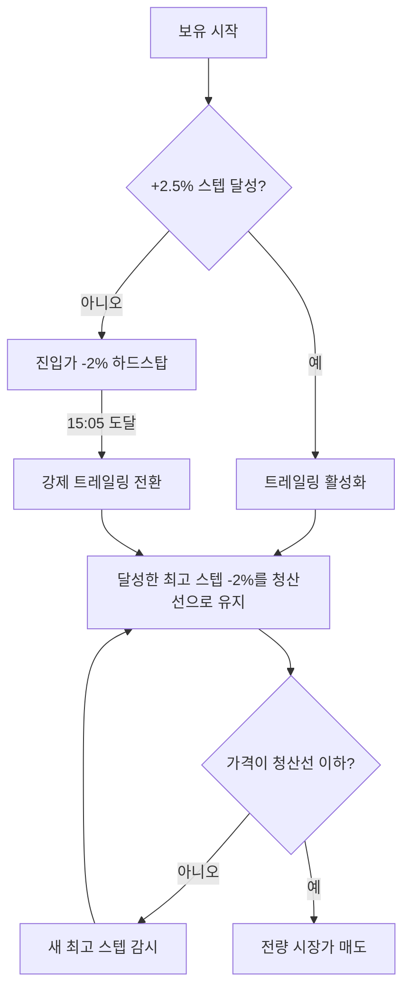
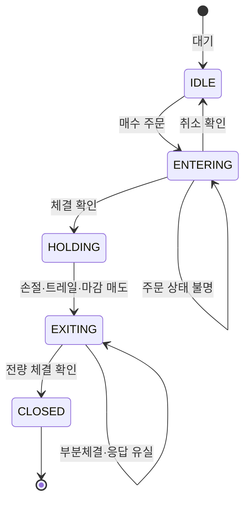

# DAILY 1 갭업 자동매매 시스템

KOSPI·KOSDAQ 갭업 종목을 찾고, 하루 한 종목의 매수부터 장중 손절·수익 보호·마감 청산까지 자동으로 관리하는 시스템입니다. 한국투자증권(KIS) OpenAPI를 사용하며 모의투자(`PAPER`)와 실계좌(`REAL`)를 지원합니다.

> 자동매매는 수익을 보장하지 않습니다. PC·네트워크·증권사 API가 멈추면 손절 주문도 실행되지 않을 수 있습니다. 장중에는 Telegram 알림을 받을 수 있어야 하며, MTS/HTS로 직접 청산할 준비가 필요합니다.

## 먼저 알아둘 용어

| 용어 | 쉬운 설명 |
|---|---|
| 갭 | 오늘 예상 체결가가 전일 종가보다 얼마나 높게 시작하는지 나타낸 비율 |
| 예상 체결대금 | 예상 가격과 예상 체결수량으로 추정한 거래 규모. 클수록 주문이 비교적 원활하게 체결될 가능성이 높음 |
| VI | 변동성완화장치. 가격이 빠르게 움직일 때 일반 체결을 잠시 멈추고 단일가 매매로 전환하는 시장 안전장치 |
| 1호 매도호가 | 현재 매도자가 제시한 가격 중 가장 낮은 가격 |
| 슬리피지 | 주문을 판단한 가격보다 실제 체결가격이 불리하게 달라진 폭 |
| MTS/HTS | 증권사의 모바일·PC 거래 프로그램. 자동매매 장애 시 주문과 잔고를 직접 확인하는 수단 |

## 한눈에 보기

| 항목 | 기본 운영 방식 |
|---|---|
| 거래 대상 | KOSPI·KOSDAQ 갭업 종목 |
| 거래 횟수 | 하루 최대 한 종목 |
| 선호 갭 | 전일 종가 대비 `+2.5% ~ +8%` |
| 고갭 조건 | `+8% ~ +10%`는 예상 체결대금 10억원 이상만 허용 |
| 매수 방식 | 최종 호가를 다시 확인한 뒤 가격 상한 지정가 매수 |
| 진입 마감 | 09:11 이후 신규 매수 금지 |
| 기본 손절 | 진입가 대비 `-2%` |
| 수익 보호 | `+2.5%` 단위 Step Trailing, 스텝에서 `-2%` 하락 시 청산 |
| 마감 관리 | 15:05 강제 트레일 활성화, 15:15 잔여 수량 청산 |

## 하루 매매 흐름



| 단계 | 시스템이 하는 일 | 운영자가 보는 결과 |
|---|---|---|
| F1 | 갭, 예상 체결대금, 거래량 증가 등을 확인해 후보를 만듭니다 | 후보 목록 |
| F2 | 통과 후보를 점수화하고 우선순위를 정합니다 | 1순위 대상 종목 |
| F3 | 가격·VI·호가·주문가능금액을 다시 확인하고 매수합니다 | 주문·체결 또는 차단 사유 |
| F4 | 보유 중 실시간 가격을 감시해 손절 또는 수익 보호 청산을 실행합니다 | 현재 손익·청산선 |
| F5 | 15:15에 남은 수량을 확인해 전량 청산합니다 | 최종 체결·당일 손익 |

F1이 끝나면 F2와 F3는 바로 이어서 실행됩니다. 프로그램을 조금 늦게 켜도 진입 가능 시간 안이라면 이어서 처리하지만, 09:11을 넘겨 새 매수를 내지는 않습니다.

## 종목은 어떻게 고르나요?

후보의 갭 크기와 예상 체결대금을 함께 보고 과열·체결 위험을 걸러냅니다. VI가
발동한 종목은 원하는 가격에 즉시 체결되기 어려워 후보를 교체하거나 해제를 기다립니다.



핵심 규칙은 다음과 같습니다.

- `2.5% ~ 8%`를 선호 구간으로 봅니다.
- `8% ~ 10%`는 예상 체결대금이 10억원 이상일 때만 허용합니다.
- 예상 체결대금이 없으면 5일 평균 거래대금을 보조 기준으로 사용합니다.
- `10% 이상`은 과열과 VI 발동·추격매수 위험 때문에 제외합니다.
- F3에서 가격을 다시 확인했을 때 `8% ~ 10%`인데 10억원 미만이면 `HIGH_GAP_AMOUNT_LOW`로 차단합니다.
- 1순위가 차단되면 2순위 후보를 다시 확인합니다. 모든 후보가 부적격이면 그날은 거래하지 않습니다.

2026-08-13 실제 사례처럼 예상 체결대금이 5.48억원이고 F3 재검증 갭이
8.08%라면 고갭 10억원 조건을 충족하지 못하므로 주문하지 않는 것이 정상입니다.

## 매수는 어떻게 하나요?

F3는 시장가로 추격 매수하지 않습니다.

1. 대상 종목의 최신 예상 가격과 전일 종가를 다시 조회합니다.
2. 실제 VI 발동 여부를 확인합니다. 대체 후보가 있으면 VI 해제를 기다리기보다 후보를 교체합니다.
3. 주문 직전 최신 1호 매도호가를 다시 확인합니다.
4. 최종 호가와 허용 갭 상한 중 낮은 가격으로 지정가 주문을 냅니다.
5. 체결되지 않은 잔량은 취소를 확인한 뒤에만 다음 시도를 진행합니다.

고갭 유동성 조건을 충족하지 못하면 주문 상한도 8% 미만의 마지막 유효 호가로 제한됩니다. 주문 후 비정상 체결가나 정책 위반이 뒤늦게 확인되면 `SLIPPAGE_GUARD`로 방어 청산합니다.

주문 접수·취소·체결 상태가 불분명하면 신규 주문을 중단합니다. 이 경우 Telegram과 주문 화면의 `MTS 즉시확인` 안내를 우선 확인하세요.

## 보유 중에는 어떻게 청산하나요?

### 손절과 Step Trailing



진입가가 100,000원일 때의 예시는 다음과 같습니다.

| 달성한 최고 스텝 | 트레일 청산선 | 보호하는 수익 |
|---:|---:|---:|
| 아직 없음 | 98,000원 | -2.0% 손절 |
| +2.5% | 100,500원 | +0.5% |
| +5.0% | 103,000원 | +3.0% |
| +7.5% | 105,500원 | +5.5% |
| +10.0% | 108,000원 | +8.0% |

15:05에는 스텝을 달성하지 못한 종목도 트레일링 상태로 전환합니다. 현재 트레일 폭과 하드스탑이 모두 2%이므로 최고 스텝이 0인 경우 청산 가격은 동일합니다. 기존 1.5% 규칙과 현재 2.0% 규칙은 실제 주문을 추가하지 않고 결과만 비교하는 모의투자 shadow 데이터로 평가하고 있습니다.

### 마감 청산

- 15:14:50에 실제 보유 수량을 다시 확인합니다.
- 15:15부터 남은 수량을 시장가로 청산합니다.
- 부분체결이면 체결된 수량을 반영하고 검증된 잔량만 다시 주문합니다.
- 전량 체결이 확인되어야 거래를 `CLOSED`로 처리합니다.
- 끝내 확인되지 않으면 자동으로 성공 처리하지 않고 긴급 알림을 보냅니다.

## 장애가 발생하면 어떻게 되나요?



프로그램은 상태 파일과 증권사 주문·잔고를 대조해 재시작 복구를 시도합니다. 다만 자동 복구가 수동 확인을 대신하지는 않습니다.

| 상황 | 시스템 대응 | 운영자 행동 |
|---|---|---|
| 실시간 시세 연결 중단 | 보조 시세 조회로 가격을 계속 확인 | 연결 상태와 가격 갱신 확인 |
| 진입 주문 상태 불명 (`ENTRY_CANCEL_UNCONFIRMED`) | 후보 교체와 신규 주문 중단 | MTS에서 주문·보유 수량 확인 |
| 매도 주문 부분체결 | 확인된 잔량만 재청산 | 잔량과 미체결 주문 확인 |
| 재시작 후 매도 대사 미완료 (`EXIT_ORDER_RECOVERY_PENDING`) | 중복 매도를 막고 미해결 상태 유지 | MTS의 주문·체결·잔고를 즉시 대조 |
| 마감 청산 실패 (`TIMEOUT_ORDER_FAILED`) | 긴급 알림 후 미해결 상태 유지 | 즉시 MTS/HTS에서 수동 청산 |
| 장중 PC·네트워크 장애 | 손절 감시 불가 | 복구가 늦으면 직접 청산 판단 |
| 전일 포지션 잔류 의심 | 당일 신규 진입 차단 | 계좌와 상태를 대조한 뒤 정리 |

`CRIT`는 즉시 사람의 확인이 필요한 긴급도 표시입니다. 위 코드가 붙은 알림은
자동으로 해결됐다고 가정하지 말고 표의 운영자 행동을 먼저 수행하세요.

## 운영 화면

실행 후 기본 주소는 [http://localhost:8080](http://localhost:8080)입니다.

| 메뉴 | 확인할 내용 |
|---|---|
| 오늘 | F1~F5 진행 상태, 대상 종목, 현재 손익, 가격 흐름, 청산선 |
| 우선 선정 | 후보 순위와 갭·예상 체결대금 |
| 자산 | 예수금, 주문가능금액, 보유 수량, 평가손익 |
| 주문 | 매수·매도·취소·부분체결·상태 불명 주문 |
| 이력 | 날짜별 진입가·청산가·손익·청산 사유 |
| 통계 | 승률, 평균 손익, 손절·트레일·마감 청산 성과 |
| 설정 | REAL 준비도(실계좌 전환에 필요한 100점 점수)와 현재 차단 사유 |

장중에는 특히 다음 세 가지를 확인하세요.

1. 실제 계좌 보유 수량과 화면 수량이 같은가?
2. 주문 화면에 `MTS 즉시확인`이 남아 있지 않은가?
3. Telegram 긴급 알림이나 가격 갱신 중단이 없는가?

## 처음 시작하기

### 1. 설치

Python 3.12 환경을 권장합니다.

```powershell
python -m venv .venv
.\.venv\Scripts\Activate.ps1
pip install -r requirements.txt
copy .env.example .env
```

### 2. 계좌와 알림 설정

`.env`에서 다음 항목을 먼저 설정합니다.

앱 키 발급, KIS 모의투자 신청, Telegram 봇과 Chat ID 생성 방법은
[KIS·Telegram 최초 설정 안내](docs/DEV_ENV.md)를 먼저 따라 하세요(문서의 6~7장).

```env
KIS_MODE=PAPER
KIS_APP_KEY=your_app_key
KIS_APP_SECRET=your_app_secret
KIS_ACCOUNT_NO=12345678-01
KIS_ACCOUNT_TYPE=01
TELEGRAM_BOT_TOKEN=your_bot_token
TELEGRAM_CHAT_ID=your_chat_id
```

세부 전략값과 API 주소는 [.env.example](.env.example)의 설명을 따르세요. `.env`에는 계좌 비밀정보가 있으므로 외부에 공유하거나 Git에 커밋하면 안 됩니다.

### 3. 실행

저장소 폴더의 **`stock.bat`을 더블클릭**하세요. 가상환경, `.env`, 실행 모드,
중복 실행, 화면 포트를 차례로 점검한 뒤 실행합니다. 문제가 있으면 원인과
해결 명령어를 화면에 보여주고 멈춥니다.

실계좌(`REAL`) 모드일 때는 실행 전에 한 번 더 확인을 받습니다.

로그는 창에 실시간으로 흐르면서 `data\logs\launcher_<날짜>_<시각>.log`에도
남습니다. 중지하려면 창에서 Ctrl+C를 누르세요.

명령어로 실행하려면 다음과 같이 합니다.

```powershell
.\.venv\Scripts\Activate.ps1
python main.py
```

이미 실행 중인 봇을 재시작할 때는 `stock.bat`이 아니라 아래를 쓰세요. 포지션과
미해결 주문이 없을 때만 실행됩니다.

```powershell
.\scripts\restart_main.ps1 -WhatIf
.\scripts\restart_main.ps1
```

## 실행 모드

| 모드 | 실제 증권사 연결 | 실제 주문 | 용도 |
|---|---:|---:|---|
| `DRY_RUN` | 아니오 | 아니오 | 화면과 전체 흐름 연습 |
| `PAPER` | 모의투자 서버 | 모의 주문 | 전략·주문·복구 검증 |
| `REAL` | 실계좌 서버 | 실제 주문 | 실전투자 준비도 100점 충족 후 운영 |

처음에는 `DRY_RUN → PAPER → REAL` 순서로 진행하세요. **실전투자 준비도**는
주문 안전장치, 같은 전략 버전의 PAPER 정상 청산 실적, REAL 계좌 설정,
알림·운영 훈련을 합산한 100점 점수입니다. Web UI의 `설정` 화면이나 아래 명령으로
현재 점수와 부족한 항목을 확인할 수 있으며, 100점 미만이면 REAL 신규 매수가
자동 차단됩니다.

```powershell
python scripts/real_readiness.py
```

전략 코드나 환경설정이 바뀌면 전략 버전 식별값(fingerprint)도 바뀌므로 새 버전의
PAPER 정상 청산 실적을 다시 쌓아야 합니다. 세부 배점과 승인 조건은
[실전투자 전환 점검표](docs/REAL_TRADING_CHECKLIST.md)를 확인하세요.

## 매일 운영 체크리스트

### 장 시작 전

- PC 절전 모드와 자동 재부팅을 해제합니다.
- 08:00 이후에는 PC를 재시작하지 않습니다. 워치독 복구까지 2~3분간 프로세스가 없어 개장 진입을 놓칠 수 있습니다. 재시작은 전날 장 마감 후나 08:00 전에 끝냅니다.
- 인터넷, KIS 인증, Telegram 수신 상태를 확인합니다.
- MTS에서 미체결 주문과 전일 잔고가 없는지 확인합니다.
- Web UI의 계좌와 주문가능금액이 실제 계좌와 같은지 확인합니다.

### 장중

- 09:11 전 진입 결과와 차단 사유를 확인합니다.
- 보유 중에는 가격 갱신과 청산선을 확인합니다.
- 긴급 알림이 오면 자동 재시도보다 MTS 주문·잔고 대사를 우선합니다.

### 장 마감 후

- 보유 수량이 0인지 확인합니다.
- 거래가 `CLOSED`이고 매도 수량이 매수 수량과 일치하는지 확인합니다.
- 실제 체결가와 시스템 기록을 대조합니다.

## 자주 묻는 질문

**조건에 맞는 종목이 없으면 어떻게 되나요?**

그날은 거래하지 않습니다. 무거래는 오류가 아니라 위험 조건을 통과한 결과일 수 있습니다.

**1순위가 막히면 하루가 끝나나요?**

아닙니다. 다음 후보가 있으면 가격과 유동성을 다시 확인해 후보를 교체합니다.

**8% 이상 오른 종목도 매수하나요?**

10% 미만이면서 예상 체결대금이 10억원 이상일 때만 가능합니다. 주문 직전 조건이 깨지면 매수하지 않습니다.

**손절가가 정확히 -2%에 체결되나요?**

아닙니다. -2%는 매도 판단 기준이며 급락, VI, 통신 지연, 시장가 슬리피지로 실제 손실은 더 커질 수 있습니다.

**프로그램을 꺼도 손절 주문이 살아 있나요?**

아닙니다. 손절과 트레일링은 프로그램이 가격을 감시하다 직접 주문하는 방식입니다.

**실계좌로 바로 실행할 수 있나요?**

실전투자 준비도 100점 미만이면 REAL 신규 매수가 차단됩니다. Web UI의 `설정`
화면이나 `python scripts/real_readiness.py`에서 부족한 항목을 확인하고, 먼저 PAPER
거래와 운영 훈련을 완료하세요.

## 상세 문서

README는 매매와 운영 흐름만 설명합니다. 세부 설계와 개발 정보는 아래 문서에 분리되어 있습니다.

- [제품 및 매매 규칙](docs/PRD.md)
- [실전투자 전환 점검표](docs/REAL_TRADING_CHECKLIST.md)
- [PAPER 전략 개선 계획](docs/PAPER_STRATEGY_IMPROVEMENT_PLAN.md)
- [개발 환경과 전체 설정](docs/DEV_ENV.md)
- [DB 설계](docs/DB_DESIGN.md)
- [UI 설계](docs/UI_DESIGN.md)
- [코딩 지침](docs/CODING_GUIDELINES.md)
